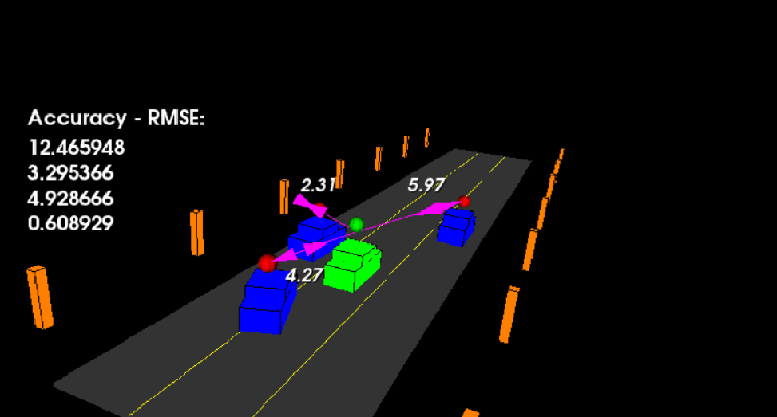

# SFND Unscented Kalman Filter

## Project Description
In this project I implemented an Unscented Kalman Filter (UKF) to estimate the state of multiple cars on a highway using noisy lidar and radar measurements. The state for each vehicle include position in X, position in Y, velocity in X, and velocity in Y. During the simulation, for state estimates of all cars, I obtain Root Mean Square Error (RMSE) values that are lower that the following tolerances:

RSME Tolerance Thresholds
| Metric       | Value                 | 
| -----------  | --------------------- |
| X-Position   | 0.30 meters           |
| Y-Position   | 0.16 meters           |
| X-Velocity   | 0.95 meters/second    |
| Y-Velocity   | 0.70 meters/second    |

## Unscented Kalman Filter Demo
`main.cpp` uses `highway.h` to create a straight 3 lane highway environment with 3 traffic cars and the main ego car at the center. The viewer scene is centered around the ego car and the coordinate system is relative to the ego car as well. The ego car is green while the other traffic cars are blue. The traffic cars will be accelerating and altering their steering to change lanes. Each of the traffic cars has it's own UKF object generated for it, and will update each indidual one during every time step. The red spheres above cars represent the (x,y) lidar detection and the purple lines show the radar measurements with the velocity magnitude along the detected angle. The Z axis is not taken into account for tracking, the UKF for each vehicle tracks only along the X/Y axes.

The following .GIF shows the results of designing and running the Unscented Kalman Filter over the course of 300 frames of highway simulation data.

---

## Project Dependencies
* cmake >= 3.5
  * All OSes: [click here for installation instructions](https://cmake.org/install/)
* make >= 4.1 (Linux, Mac), 3.81 (Windows)
  * Linux: make is installed by default on most Linux distros
  * Mac: [install Xcode command line tools to get make](https://developer.apple.com/xcode/features/)
  * Windows: [Click here for installation instructions](http://gnuwin32.sourceforge.net/packages/make.htm)
* gcc/g++ >= 5.4
  * Linux: gcc / g++ is installed by default on most Linux distros
  * Mac: same deal as make - [install Xcode command line tools](https://developer.apple.com/xcode/features/)
  * Windows: recommend using [MinGW](http://www.mingw.org/)
 * PCL 1.2

## Basic Build Instructions

1. Clone this repo.
2. Make a build directory: `mkdir build && cd build`
3. Compile: `cmake .. && make`
4. Run it: `./ukf_highway`